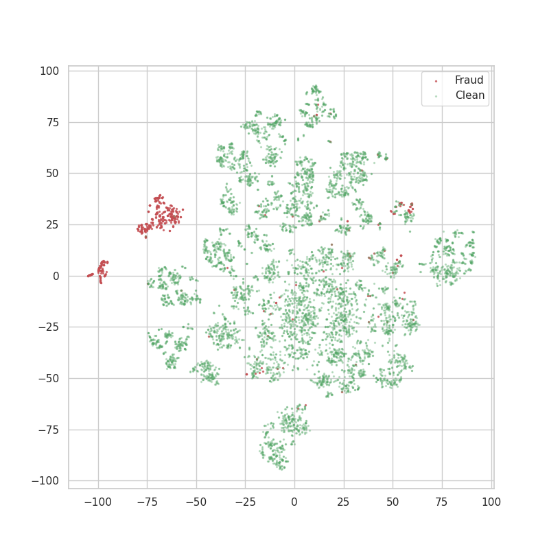

# Anomaly detection in the creditcard dataset
Using a type of artificial neural network called autoencoders is possible to detect anomalies based on the ability to encode and decode a certain type of data by learning from its probability distribution.

In this technique, the identification of the anomalous data is performed detecting outliers in the distribution of the decoding errors of the trained autoencoder.
